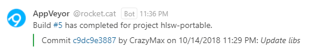

<p align="center"></p>

<p align="center">
  <a href="https://github.com/sponsors/crazy-max"></a>
  <a href="https://www.paypal.me/crazyws"></a>
</p>

## About

Add [AppVeyor](https://www.appveyor.com) notifications via a new WebHook in Rocket.Chat.

## Receive alerts

1. Create a new **Incoming WebHook**
2. Select the channel where you will receive the alerts. You may wish to create a dedicated channel for your notifications.
3. Select an account from which the alerts will be posted. You may wish to create a dedicated account just for notifications.
4. Set the "Enable Scripts" option to `True`.
5. Copy content of [appveyor-incoming.js](src/appveyor-incoming.js) in Script field.
6. Save the integration. This will generate a webhook URL and secret for you.
7. In your `appveyor.yml` file add webhook parameter with webhook URL generated.

```yaml
notifications:
  - provider: Webhook
    url: <webhook_url>
    method: post
```

It's highly suggested, for security reasons, to encrypt the URL with the [configuration encryption tool](https://ci.appveyor.com/tools/encrypt) provided by AppVeyor :

```yaml
notifications:
  - provider: Webhook
    url:
      secure: <encrypted_webhook_url>
    method: post
```

This script will generate notifications for the following build events:

- Build completed / failed status for any pushed code
- Build completed / failed status for new Pull Request



*Note:* If status is completed, message color is green otherwise it is red.

If you want more customizations, please look in AppVeyor documentation: <https://www.appveyor.com/docs/notifications/#webhooks>

## How can I help ?

All kinds of contributions are welcome :raised_hands:! The most basic way to show your support is to star :star2: the project, or to raise issues :speech_balloon: You can also support this project by [**becoming a sponsor on GitHub**](https://github.com/sponsors/crazy-max) :clap: or by making a [Paypal donation](https://www.paypal.me/crazyws) to ensure this journey continues indefinitely! :rocket:

Thanks again for your support, it is much appreciated! :pray:

## License

MIT. See `LICENSE` for more details.
